# System Architecture - 12 Module Pipeline

## One-line Summary

Domain knowledge retrieval is a 12-module pipeline that turns raw sources into source-backed Obsidian notes, scoped knowledge packs, runtime evidence packs, gap labels, and eval feedback.

## Canonical Format

This Markdown note is the canonical human-readable architecture. HTML files are optional visual artifacts generated from the architecture spec:

- [Compact architecture HTML](System Architecture - 12 Module Pipeline Compact.html)
- [Compact architecture JSON](System Architecture - 12 Module Pipeline Compact.dataflow.json)
- [Detailed architecture HTML](System Architecture - 12 Module Pipeline.html)
- [Detailed architecture JSON](System Architecture - 12 Module Pipeline.dataflow.json)

## Pipeline Summary

Raw sources enter through intake and trust checks, then flow through media-specific extraction and an expert-usage gate. Accepted units become Obsidian notes and scoped knowledge packs. At runtime, the retrieval tool builds heading chunks, routes the expert query through filters, ranks candidates, returns an evidence pack, and labels support quality. AI self-review checks source, extraction, citation, and confidence quality. Human checkpoints focus only on input acceptance, output acceptance, and performance acceptance.

## Mermaid Overview

```mermaid
flowchart LR
  M01["01 Source Intake<br/>raw source -> trusted source note"]
  M02["02 Media Extraction<br/>source note -> candidate units"]
  M03["03 Unit Gate<br/>candidate units -> kept/dropped units"]
  M04["04 Note Writer<br/>kept units -> Obsidian notes"]
  M05["05 Pack Builder<br/>notes -> scoped knowledge pack"]
  M06["06 Index Builder<br/>notes + metadata -> chunks"]
  M07["07 Query Router<br/>question -> scoped filters"]
  M08["08 Ranker<br/>candidates -> ranked top-k"]
  M09["09 Evidence Pack<br/>ranked top-k -> evidence JSON"]
  M10["10 Gap/Conflict<br/>evidence -> answerability"]
  M11["11 Obsidian Checkpoint<br/>evidence -> input/output/effect"]
  M12["12 Eval Loop<br/>golden questions -> fixes"]

  M01 --> M02 --> M03 --> M04 --> M05 --> M06 --> M07 --> M08 --> M09 --> M10 --> M11 --> M12
  M12 -. fixes .-> M01
  M12 -. fixes .-> M04
  M12 -. fixes .-> M05
  M12 -. fixes .-> M08
```



## Module I/O Table

| Module | Purpose | Inputs | Outputs |
| --- | --- | --- | --- |
| [[01 - Source Intake and Trust]] | Register source identity, permission, provenance, and reliability before extraction. | Raw source path, URL, or file; source type; author/owner; publication/update date; permission; target domain; AI reviewer; human checkpoint owner. | Source note; provenance metadata; trust tier; reliability label; AI review status; downstream links. |
| [[02 - Media Extraction Adapters]] | Preserve useful structure from each source medium. | Source note; raw content/media; source type; file path/URL; extraction hints. | Candidate units; OCR/captions; table/chart/layout summaries; extraction caveats; review flags. |
| [[03 - Knowledge Unit Extraction Gate]] | Decide what raw material is expert-usable. | Candidate units; domain; supported decisions; source reliability/caveats; existing notes. | Kept units; dropped/deferred units with reasons; unit type; destination folder/pack. |
| [[04 - Knowledge Note Writer]] | Convert kept units into human-readable, retrievable Obsidian notes. | Kept unit; source reference; domain; reliability; caveat; target pack. | Markdown note; flat metadata; summary; source links; agent usage guidance; review status. |
| [[05 - Knowledge Pack Builder]] | Bundle notes into scoped expert memory. | Expert domain; target user; supported decisions; source/concept/case/claim/checklist/failure notes; tools; unsupported areas; golden questions. | Knowledge pack note; retrieval filters; reliability floor; included links; unsupported areas; eval hooks. |
| [[06 - Retrieval Index Builder]] | Build searchable records and heading chunks from notes. | Obsidian notes; frontmatter; headings; source refs; pack filters. | Indexed note records; heading chunks; searchable metadata; source refs; Obsidian URIs. |
| [[07 - Query Scope Router]] | Translate a question into retrieval scope and filters. | Expert/user query; blueprint; known domain/pack; reliability requirement; tool policy. | Scoped query; selected pack; domain/type/tag/status filters; reliability floor; search intent. |
| [[08 - Retrieval Ranker]] | Rank and diversify retrieval candidates. | Scoped query; candidate chunks; note metadata; pack scope; reliability labels. | Ranked top-k; score per result; best heading per note; excluded or low-quality candidates. |
| [[09 - Evidence Pack Builder]] | Normalize retrieval results into agent-facing evidence. | Ranked results; query/filter context; source refs; caveats; usage guidance; Obsidian paths. | Evidence pack JSON; human-readable evidence list; Obsidian links; gaps placeholder. |
| [[10 - Gap and Conflict Detector]] | Label whether evidence can support the expert answer. | Evidence candidates; source reliability/date/caveats; unsupported areas; user question. | `supported`, `partial`, `gap`, or `conflict`; gap messages; conflict notes; next action. |
| [[11 - Obsidian Human Review Interface]] | Make pipeline artifacts checkpointable by humans and reviewable by AI. | Evidence pack; source notes; wiki links; AI review flags; input/output/performance checkpoint fields; eval reports. | Checkpointable indexes; Obsidian links; AI review results; human input/output/effect acceptance; fix requests. |
| [[12 - Retrieval Eval Feedback Loop]] | Test retrieval quality and route fixes upstream. | Golden questions; expected notes; forbidden notes; retrieval output; AI self-review result; human performance checkpoint. | Pass/fail report; failure category; performance summary; fixes to sources, metadata, chunks, ranking, packs, or evals. |

## Main Path

1. Source material is registered by [[01 - Source Intake and Trust]].
2. The right extractor is selected by [[02 - Media Extraction Adapters]].
3. Expert-usable units are selected by [[03 - Knowledge Unit Extraction Gate]].
4. Units become Obsidian notes through [[04 - Knowledge Note Writer]].
5. Notes are bundled into scoped memory by [[05 - Knowledge Pack Builder]].
6. Runtime retrieval uses [[06 - Retrieval Index Builder]], [[07 - Query Scope Router]], [[08 - Retrieval Ranker]], [[09 - Evidence Pack Builder]], and [[10 - Gap and Conflict Detector]].
7. AI self-reviews the result and humans checkpoint input/output/performance in [[11 - Obsidian Human Review Interface]].
8. [[12 - Retrieval Eval Feedback Loop]] turns failures into concrete upstream fixes.

## Module Completion Map

| Module Range | V1 Implementation | Validation |
| --- | --- | --- |
| 01-05 | Runbooks, templates, source trust standard, and knowledge pack contract. | `tools/validate_vault.py` checks source/pack metadata, required sections, and links. |
| 06-10 | `tools/agent_retrieve.py` builds heading chunks, applies filters, ranks results, returns evidence packs, and labels answerability. | Retrieval smoke tests and `tools/eval_retrieval.py`. |
| 11 | Obsidian wiki links, metadata, index notes, evidence-pack `obsidian_uri` fields, AI review trace, and human checkpoint fields. | `tools/validate_vault.py` checks links and checkpoint-facing fields. |
| 12 | Golden retrieval questions and eval runner. | `tools/eval_retrieval.py` reports pass/fail and failure categories. |

## Tools

```bash
python3 tools/ingest_sources.py scan --domain your-domain
python3 tools/agent_retrieve.py "your expert question" --reliability-floor medium
python3 tools/validate_vault.py
python3 tools/eval_retrieval.py --all
```

## Feedback Path

Eval, AI-review, or human-checkpoint failures should be fixed at the owning module:

| Failure | Fix Owner |
| --- | --- |
| Missing or weak source | [[01 - Source Intake and Trust]] |
| Bad OCR, missing chart/table detail, or visual overinterpretation | [[02 - Media Extraction Adapters]] |
| Low-signal or missing knowledge unit | [[03 - Knowledge Unit Extraction Gate]] |
| Bad metadata, caveat, source link, or note shape | [[04 - Knowledge Note Writer]] |
| Wrong scope, missing unsupported area, or missing golden question | [[05 - Knowledge Pack Builder]] |
| Bad chunk boundary or missing searchable field | [[06 - Retrieval Index Builder]] |
| Wrong domain/type/tag/reliability filter | [[07 - Query Scope Router]] |
| Expected note not in top-k | [[08 - Retrieval Ranker]] |
| Evidence pack missing required field | [[09 - Evidence Pack Builder]] |
| Unsupported evidence labeled too confidently | [[10 - Gap and Conflict Detector]] |
| Human cannot inspect input/output/performance checkpoints | [[11 - Obsidian Human Review Interface]] |
| AI self-review misses citation, confidence, or extraction issues | [[11 - Obsidian Human Review Interface]] |
| Eval case is absent, stale, or too easy | [[12 - Retrieval Eval Feedback Loop]] |

## Design Evidence

The design is grounded in [[../../02_Domain-Knowledge/Sources/Source - Retrieval and Tooling Best Practices|Retrieval and Tooling Best Practices]], which records official and provider sources for RAG pipeline design, chunking, metadata filtering, document extraction, MCP tool/resource/prompt boundaries, and Obsidian properties/internal links.

The review boundary is defined in [[../AI Self-Review and Human Checkpoint Standard]], which assigns source, extraction, citation, and confidence review to AI while keeping humans focused on input, output, and performance checkpoints.

## Open Decisions

- Pick the first real expert domain and build its first knowledge pack.
- Decide whether image extraction starts manual-first or uses OCR/vision service first.
- Decide whether future V2 semantic retrieval uses a local embedding model or an API.
- Decide whether generated architecture HTML/screenshots should be committed, or kept as local review artifacts only.
